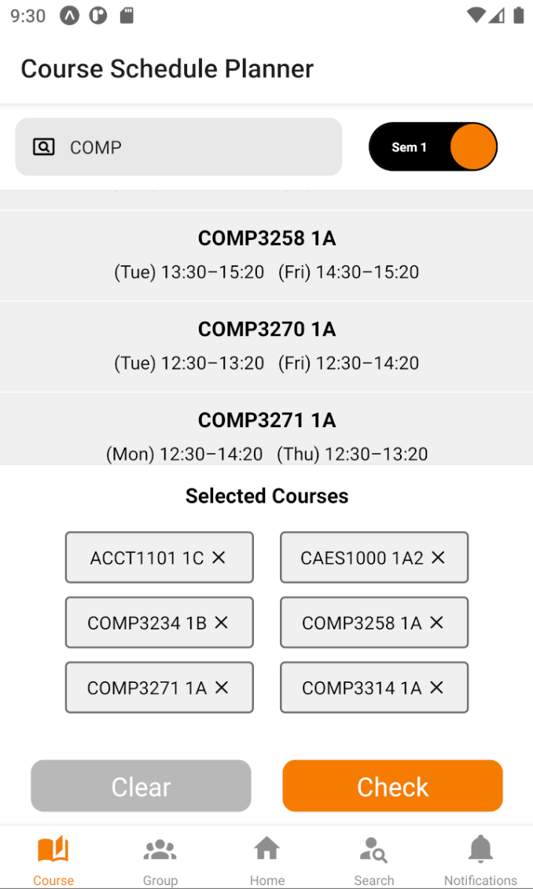
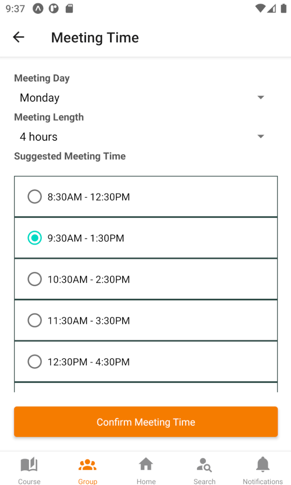

# CourseMate
## Overview
***CourseMate*** is a cross-platform mobile application developed with React Native and JavaScript. The app aims at helping HKU students to verify the feasibility of their course selection and recommend available time slots for group meetings.

## Demo Pics
  

## Installation Guide
### 1. Clone this repository
Execute the following command in a local directory:
</br>
``` git clone https://github.com/kyctsang/Coursemate.git ```.

### 2. Install npm and yarn
[Download](https://nodejs.org/en/download/) Node.js and npm if not yet installed.

Install yarn with ``` npm install --global yarn ```.

### 3. Install dependencies
Go to the cloned directory ***CourseMate***.

Install all dependencies with ``` yarn install ```.

### 4. Run the app
Run the app with ``` yarn run ```, then type ``` start ```.

Choose to run the app on a Android/iOS device in the section shown below. Download the app ***Expo Go*** on a mobile device and scan the Expo QR code shown below with ***Expo Go***.


Now ***CourseMate*** should be running on the mobile device!
